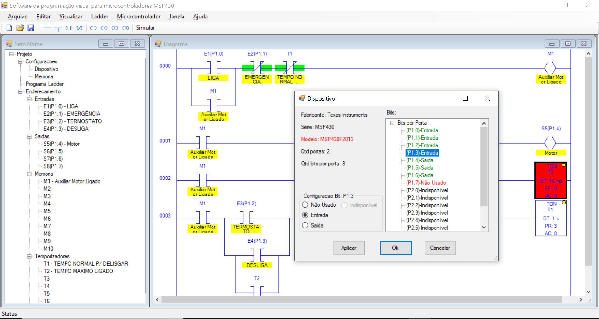

# LadderApp

Este projeto foi desenvolvido no final de ano de 2010 como meu Trabalho de Conclusão de Curso (TCC) na graduação em Sistemas de Informação. Ele reflete algumas das minhas áreas de interesse (desenvolvimento, poo, automação, microcontroladores).

Na época, eu gostaria de ter desenvolvido este trabalho em Java para Web, mas, a correria da vida, do trabalho e da faculdade não me permitiu acreditar como trabalho viável (para entrega na data), e isso ficou para uma próxima oportunidade.

O LadderApp basicamente permite que você desenvolva uma aplicação na linguagem ladder (padrão IEC 61131-3) e ele irá realizar a conversão deste programa uma na linguagem C do microcontrolador, permitindo que este programa seja compilado e enviado ao microcontrolador. Um bônus foi a inclusão de uma funcionalidade de simulação, que permite que o usuário simule o a execução do código ladder diretamente na interface. 

Na época o microcontrolador escolhido foi o [MSP430 da Texas Instruments](http://www.ti.com/microcontrollers/msp430-ultra-low-power-mcus/overview.html). Agora a ideia é trabalhar para que a aplicação gere código para a plataforma [Arduíno](https://www.arduino.cc/).

 

